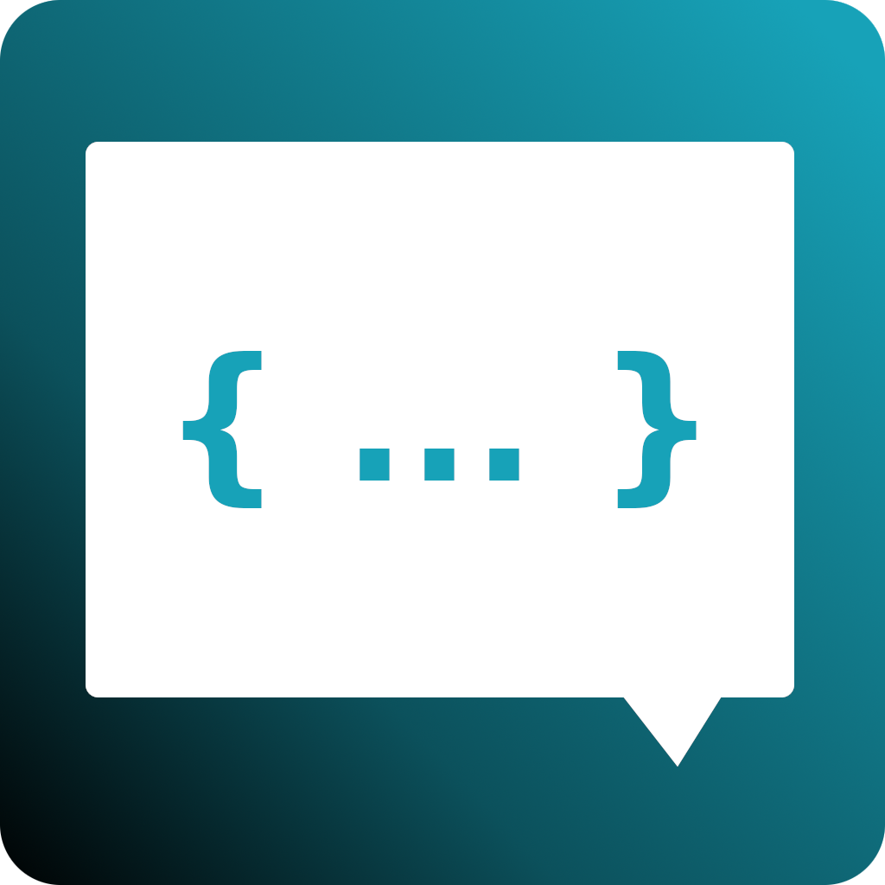

  

<h1 align="center">
  Redis-X
</h1>

  A simple GUI alternative to redis-cli

# Development

Run `npm start` to run the app locally.

# Production

Run `npm run pkg:${env}` to package the app using production builds locally

# Publish

Run `npm run publish` to publish a release

# Built Using

- [Electron](https://electronjs.org) - Desktop Framework
- [Angular](https://angular.io/) - Web Framework
